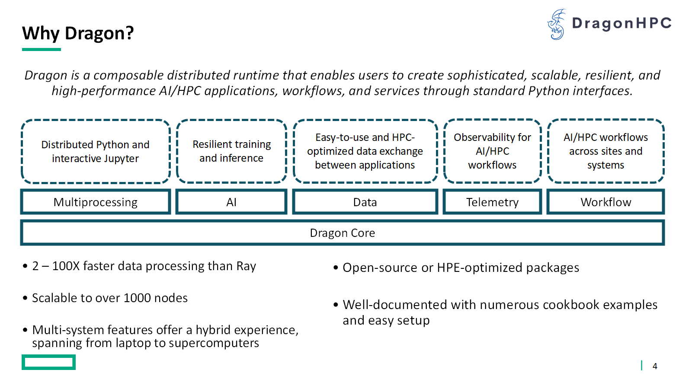
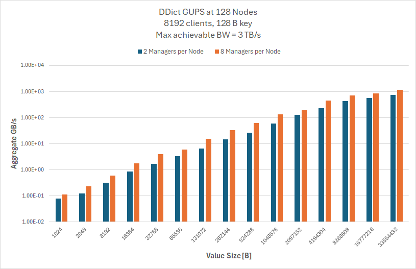

# Introduction to Dragon
Wondering where to start with [Dragon](http://dragonhpc.org/)? This page is for you. We'll walk through the select patterns and abstractions
and have you quickly programming at scale.

## Python multiprocessing
Dragon was initially designed to allow developers to program to the standard [Python multiprocessing API](https://docs.python.org/3/library/multiprocessing.html)
and scale their application to an entire supercomputer. The team took what they learned developing high-performamce, scalable software for Cray, Inc. and
apply it to the standard API for parallel Python. We won't duplicate `multiprocessing` documentation here, but it is worth reviewing some of the key interfaces
and their typical use cases.

### Pool
The `multiprocessing` documentation introduces the API with this basic example using `Pool.map()`.

    from multiprocessing import Pool

    def f(x):
        return x*x

    if __name__ == '__main__':
        with Pool(5) as p:
            print(p.map(f, [1, 2, 3]))

This code starts up an additional 5 processes and executes the function `f()` across each item in the list `[1,2,3]`. When your application has a pattern like this,
`Pool.map()` is a great tool for getting true parallel performance as each process is its own interpreter and GIL. This is especially important when the list of items
is very large. The Dragon version of this code looks like the following:

    import dragon
    from multiprocessing import Pool

    def f(x):
        return x*x

    if __name__ == '__main__':
        mp.set_start_method("dragon")
        with Pool(5) as p:
            print(p.map(f, [1, 2, 3]))

We needed to add a single `import dragon` and tell `multiprocessing` to use the `dragon` start method. That's it. If this code then called libraries underneath that
also use `multiprocessing`, those two steps enables Dragon for the libraries as well. But what do I get from this? The true power of Dragon comes when you have a very
large working set and can scale across an entire cluster. As of the Dragon v0.9 release, we regularily test `mp.Pool()` with over 50,000 workers on hundreds of nodes on a
Cray EX supercomputer.

    import dragon
    from multiprocessing import Pool

    def f(x):
        return x*x

    if __name__ == '__main__':
        mp.set_start_method("dragon")
        with Pool(50000) as p:
            print(p.map(f, range(50000))

You can also manage multiple `mp.Pool()` instances at once and have them come and go at different times. This is great for use-cases where the nature of computation
changes over time. For example, imagine we had to process two types of files, `type A` and `type B`. Let's say `type A` takes twice as much time to process a single
file as `type B`. One approach to balance the processing could look like this:

    import dragon
    from multiprocessing import Pool

    def f(x):
        return x*x

    if __name__ == '__main__':
        mp.set_start_method("dragon")

        typeAfiles = # some long list
        typeBfiles = # some other long list

        poola = Pool(2000)
        poolb = Pool(1000)

        resultsa = poola.map_async(f, typeAfiles
        resultsb = poolb.map_async(f, typeBfiles)
        for result in resultsa.get()
            # do something
        for result in resultsb.get()
            # do something

        poola.close()
        poolb.close
        poola.join()
        poolb.join()

Since we can manage the life-cycle of `mp.Pool()` explicitly, we can have them close and bring up new ones as our computational load changes. For Dragon users,
they can start to view their set of nodes as a single collection of resources and program different elements of their application to use different amounts of
resources over time. It's kind of cloud-like.

In addition to scaling `mp.Pool()` to supercomputer scales, Dragon also lets users do something base `multiprocessing` doesn't let you do. You can nest `mp.Pool()`
inside of one another. Pools that use Pool?! Why might you want that? There are a lot of use-cases for this. Imagine your use-case is to process different types of
data as they land in a filesystem. Imagine that each file has many components that themselves require `Pool.map()`-like operations. Something like this:

    import dragon
    from multiprocessing import Pool

    def proc_data(d):
        # do some work

    def f(workfile):
        with open(workfile, "rb") as f:
            data = f.read()
            with Pool(128) as p:
                results = p.map(proc_data, list(data))
        return results

    if __name__ == '__main__':
        mp.set_start_method("dragon")

        files = # some long list
        with Pool(128) as p:
            all_results = p.map(f, files)

There is much more you can do with `mp.Pool` yet, especially when an entire supercomputer's resources are at your command. The key thing is that with Dragon's
implementation you can scale out, get great performance on the internal communication that happens in `mp.Pool()`, and it integrates with the rest of the Python
ecosystem as it should.

### Queue
The other interface we typically highlight from `multiprocessing` is [`mp.Queue`](https://docs.python.org/3/library/multiprocessing.html#multiprocessing.Queue).
We often use it any time there are multiple readers and/or writers needing to communicate. It's a FIFO-style queue, and with Dragon's implementation, processes
can transparently access it from any node in a supercomputer the Dragon runtime is deployed to. `mp.Queue` is used internally in `mp.Pool` for both the input of
items to process and the results that come back to the calling process. Since we test Dragon's `mp.Pool` implementation on hundreds of nodes, we know our `mp.Queue`
scales well. We do have designs for even better scaling, but that's for a different document. Here's how to use `mp.Queue` in combination with another idiom from
`multiprocessing` called `mp.Process`.

    import dragon
    from multiprocessing import Process, Queue

    def compute_it(f):
        # do something

    def work(f, resultq):
        resultq.put(compute_it(f))

     if __name__ == '__main__':
        mp.set_start_method("dragon")

        q = Queue()
        somedata = # some data
        p = Process(target=work, args=(somedata, q,))
        p.start()

        result = q.get()
        p.join()

`mp.Queue` is a "pickleable" object, which means you can pass it as an argument to an entirely different Python process, as done in this example. The same is true for
all the other communication and collective primitives in `multiprocessing`. Dragon's implementation relies on our high-performance (Shared memory+RDMA-capable) communication layer,
called [`Channels`](https://dragonhpc.github.io/dragon/doc/_build/html/ref/core/index.html#channels).

## Data
The Python [`dict`](https://dragonhpc.github.io/dragon/doc/_build/html/ref/core/index.html#channels) is one of the most fundamental and useful abstractions in the language, in our opinon. What if we had a `dict` that scaled to hundreds or thousands of nodes
and could be accessed by thousands of processes at the same time? Dragon has this feature. With the Dragon distributed `dict`, [DDict](https://dragonhpc.github.io/dragon/doc/_build/html/ref/data/ddict.html),
you can easily manage data exchange at-scale between process with great performance. Like everything communication related in Dragon, it uses our
[`Channels`](https://dragonhpc.github.io/dragon/doc/_build/html/ref/core/index.html#channels) layer for high-performance communication. It behaves with the same semantics as the
normal `dict` and how they are accessed frm multiple threads at the same time. The only difference with the `DDict` is it works across multiple processes.

Using the `DDict` looks like the following:

    import dragon
    from multiprocessing import Pool
    from dragon.data.ddict import DDict

    dist_dict = None  # this is scope only in the current process, not across processes
                      # this lets us access the variable across functions below using "global"
                      # there are other ways to do this, but this one is pretty short

    def setup(_ddict):
        global dist_dict
        dist_dict = _ddict

    def assign(x):
        global dist_dict
        key = # some object, like a string or int
        dist_dict[key] = x

    if __name__ == '__main__':
        mp.set_start_method("dragon")

        dist_dict = DDict(managers_per_node=1, num_nodes=1, total_mem=1024**3)
        
        with Pool(5, initializer=setup, initargs=(dist_dict,)) as p:
            print(p.map(assign, [1, 2, 3]))

        for k in dist_dict.keys():
            print(f"{k} = {dist_dict[k]}", flush=True)

You can start to think of the `DDict` almost like a co-located object store that scales with your application. For example, you might read in a large quanitity of
data from a filesystem and store them into the `DDict` with keys mimicing file paths. If you don't have a great parallel filesystem, this lets you read the data once,
cache it in the memory of your nodes, and leverage your network's performance (and shared memory) for subsequent accesses. You can use it instead of storing
intermediate results to a filesystem. If your workload consists of stages of Python processes in a pipeline, `DDict` is a very convinient way to manage data exchange
without any system-specific code, such as file paths.

How well does `DDict` perform though? We improve Dragon performance with each release, but this is where we are at with Dragon v0.10. With this [benchmark](gups_ddict.py),
inspired by the classic [GUPS](https://hpcchallenge.org/projectsfiles/hpcc/RandomAccess.html) benchmark, some large number of processes will write a unique set of
key/value pairs into the `DDict`. The keys are always 128 bytes in sioze, but the values vary in length per outer loop of the benchmark. The plot below shows the aggregate
bandwidth measured across the clients for writing key/value pairs with a `DDict` sharded across 128 nodes on a Cray EX system. The equivalent benchmark written for something
like SHMEM may be faster, but for the largest value sizes `DDict` is approaching 30% of the achievable bandwidth. We have seen high-end filesystems do worse. We should note,
the `DDict` is not persistent between executions of Dragon. We are working on that feature.

## Core

### ProcessGroup

## Telemetry

[Telemetry](https://zenodo.org/records/13327798)

## Workflow

[Proxy](https://zenodo.org/records/10115199)
